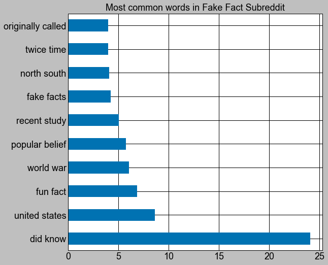
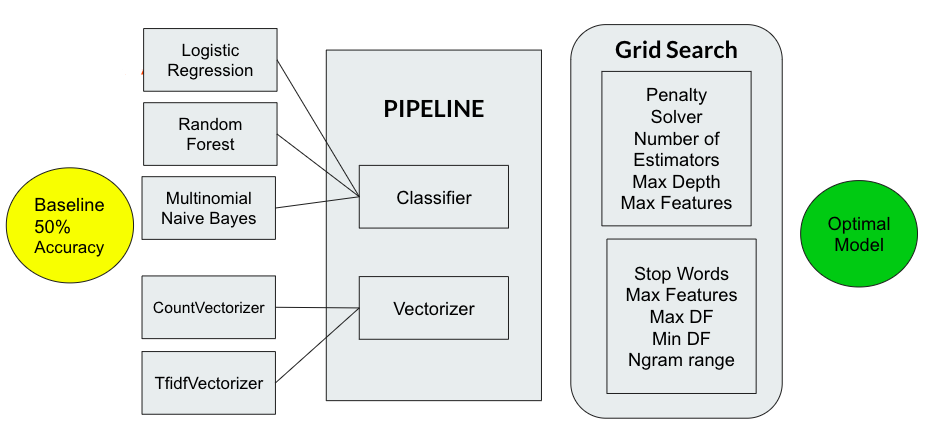

#  Project 3: Web APIs & NLP

# Table of Contents

* [Problem Statement](#problem-statement)
* [Datas Collection](#data-collection)
  * [Data Dictionary](#data-dictionary)
* [Data Cleaning and EDA](#data-cleaning-and-eda)
* [Preprocessing and Modeling](#preprocessing-and-modeling)
* [Model Evaluation](#model-evaluation)
* [Conclusion and Recommendations](#conclusion-and-recommendations)

---

## Problem Statement 
There is a lot of disinformation in social media websites. Stories that appear to be real coult not be true.
To help users differentiate true stories from fake stories, a prediction model will be built using data science.  
The goal of this project is to build a classification model using Natural Language Processing for text data to predict if a given post was published in the Fake Facts or Science subreddit. 

---

## Data Collection
- Used posts from Reddit (a social news aggregation, web content rating, and discussion website.)
- Retrieved data from two subreddits: Fake Facts and Science
- Data collected for each post: Title, User ID, URL, Number of comments, Date Created, and Body Text.
- Used PRAW, Python Reddit API Wrapper, to collect this data from Reddit, and transfer it to a Python format 
- Gathered 1971 “top” posts collected from 2017-2020
    - Science: 990,  Fake Facts: 981

      

  
     
## Data Dictionary
| Feature | Description |
| --- | --- |
| **title** | *Title of the subreddit post.* |
| **score** | *Score given to the subreddit post.* |
| **id** | *ID of the user who published the post in Reddit.* |
| **url** | *Web URL to the Reddit post.* |
| **comms_num** | *Number of comments submitted to the post.* |
| **created** | *Date when the post was created by the user.* |
| **body** | *Text in the body section of the post.* |

---

## Data Cleaning and Preprocessing
- Used Natural Language Processing to create features from the words in the Title of a subreddit post.
- Cleaned text data:
    - Removed special characters
    - Tokenize
    - Removed stop words
    - Used unigrams and bigrams
- Transformed text data into numeric values using a vectorizer.
- Compared the results from CountVectorizer and Term frequency-inverse document frequency.
- Tuned in the hyperparameters for the vectorizer using gridsearch
- The "body" feature was dropped since it was missing most values. 

## Exploratory Data Analysis
The length of the post titles was analyzed. The distributions below show the number of words in the posts for each subreddit. As seen in the graph, the lenght of posts in Fake Facts are on the lower side as opposed to the length of posts of the Science.\

Using the TFIDF Vectorizer, a score for the words that are more important to one document relative to all other documents was calculated. 
The following are the words with the highest TFIDF scores for the Fake Facts subreddit:\

 
The following are the words with the highest TFIDF scores for the Science subreddit:\

Also, the sentiment of the posts was analyzed using VADER. As seen in the graph below by the orange bar, the posts in Fake Fact show a negative opinion while the posts in Science show a positive opinion.\

---

## Model

- In order to build the model, the data was split for training (75%) and testing (25%) using Train Test Split. 
- The performance of three classifiers and two vectorizers was evaluated by building multiple combination models using a pipeline. 5-folds were used for each combination.
- Classifiers used:
  - Logistic Regression
  - Multinomial Naive Bayes
  - Random Fores
- The hyperparameters for each classifier and vectorizer were tuned in using grid search. 

The picture below shows a summary of the modeling process for this project.

## Model Evaluation
- All models showed higher accuracy in the training set than in the testing set, meaning the models were overfit. This is due to the large number of features (words) in the model.
- The baseline score for this model was 50% accuracy (there was no majority class, there were approximately the same number of posts in each of the two subreddits).
- Accuracy, Sensitivity, Specificity and Precision were calculated for all models. See below table. 

| Model | Accuracy | Sensitivity | Specificity | Precision
|---|---|---|---|---|
|Logistic Regression|0.90|0.87|0.93|0.93|
|Multinomial Naive Bayes|0.92|0.94|0.90|0.91|
|Random Forest|0.92|0.88|0.96|0.96|

- All models scored higher than baseline
- The accuracy score reflects the number of predictions the models got right.
- The sensitivity and specificity scores reflect the number of posts that were correctly classified in their respective subreddit (Sensitivity for Fake Facts, and Specificity for Science)
- The precision score represents how much we can trust these models.
- The Random Forest model was selected because it had a high accuracy and precision. The confusion matrix for this model is shown below. This matrix shows the number of correct and incorrect predictions vs the number of actual posts in the two subreddits.

Confusion Matrix for Random Forest:

---

## Conclusion and Recommendations
- The goal was to built a classification model to help a user identify if a post came from the FakeFacts subreddit or the Science subredit.
- A Random Forest classification model was built with 96% precision to predict if based on the words in a subreddit title, a post comes from Fake Facts or Science. 
- Evaluate further the pros and cons of using a Random Forest vs a Naive Bayes Classifier
- To try this model for subreddits in other languages.
- To validate this model over time and evaluate its accuracy with new posts.
